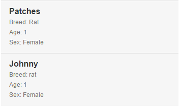

# Swipe List

This widget gives you the ability to create a list of objects that allows gestures in order to perform microflow actions to a list. 

##Authors

Simon Martyr

## Contributing

For more information on contributing to this repository visit [Github](https://github.com/Finaps/swipeList)!

For feature requests/bugs/etc please leave feedback on the Github Issues Page.

## Typical usage scenario

This widget can be used on:
- Desktop 
- Tablet 
- Phone

This widget was designed with mobile in mind to work like the email app on iOS. If you wish to have an interactve list of items this widget gives you that functionality. 
 
## Features

Main features:

Default list:

Option buttons:

Power slide:

- Display a list of objects & attributes of your choice. 
- Ability to configure two microflow buttons.
- Ability to configure on selection microflow.
- Ability to configure large swipe microflow. 
- Responsive. 
- Customizeable can change swipe direction etc. 

### Limitations

 - HTML/Layout is releatively static, could maybe be enhanced in the future.
 - Currently allows for only two buttons on left or right. Can be edited currently no plans to change this. 

## Description/configuration (Widget options)

Data Source 

- Main Object - The type of object that is used within the list.
- Attributes to display - A list of Attributes that you wish to display, all types allowed. The first attribute is treated as a title. 
- Data Source Microflow - The list of objects (main object) retrieved via a microflow.
- Show labels - show the labels of the attributes within the list. Default true, toggel to false if you wish not to show the labels. The first attribute in the attribute list is always used as a title. 

Button Options

- Two buttons or one - default two buttons, however if you want only the one button you can change this to false to only show one button.
- Microflow for button one - configure the microflow for button one, requires the main object to be an input. 
- Microflow for button two - configure the microflow for button two, requires the main object to be an input. 
- Button one's name - The name/text to appear on the button (one).
- Button Two's name - The name/text to appear on the button (two).
- Power Slide - When swiping an object in the list over 65% in the correct direction it will kick off the microflow bound to button one.
- Button align - Choose which side the buttons will be displayed. (Left or right) 
- On Click Microflow - When clicking/tapping an object this microflow with fire. 

